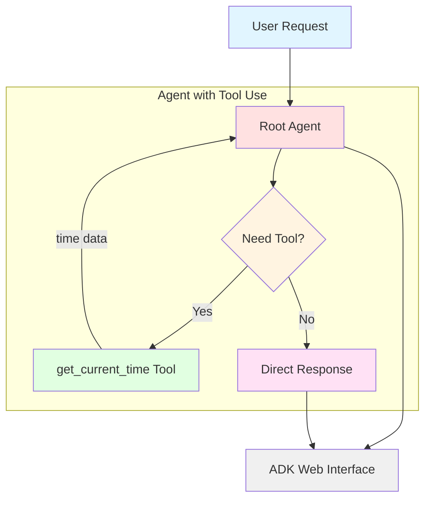

# Google Agent Development Kit (ADK) - First Agent Tutorial


Google's [Agent Development Kit (ADK)](https://google.github.io/adk-docs/) is a flexible and modular framework for developing and deploying AI agents. While optimized for Gemini and the Google ecosystem, ADK is model-agnostic, deployment-agnostic, and is built for compatibility with other frameworks. 


This guide shows you how to get up and running with your first agent in **Agent Development Kit (ADK)** for Python. This project uses Python 3.12 (ADK requires Python 3.10 or higher).

## What You'll Learn

In this tutorial, you will:
- Set up your development environment for Google ADK
- Create and configure your first AI agent
- Understand the basic structure of an ADK agent project
- Learn how to implement and use tools in your agent
- Interact with your agent using the ADK web interface
- Learn how to customize agent behavior through prompts and properties


## Prerequisites

> [!IMPORTANT]
> Before you begin, ensure you have uv installed and a Gemini API key.


- You should have `uv` installed. If you don't, follow these instructions: [uv installation guide](https://github.com/kirenz/uv-setup).

- You need a free Gemini API. Create a key in [Google AI Studio](https://aistudio.google.com/prompts/new_chat) if you haven't already.


## Steps to set up the project

Open your command line interface and change into the directory where you want to clone this repository.

Then run the following commands:

1. Clone the repository:

```bash
git clone https://github.com/kirenz/google-adk-first-agent.git
```

2. Change directory to the cloned repository:


```bash
cd google-adk-first-agent
```

3. Install the required dependencies:

```bash
uv sync
```

4. Open the project in your preferred code editor (e.g., VSCode).

5. Go to the `first_agent` directory and rename the `.example.env` file to `.env` 

6. Open the `.env` file and add your Google API key. Save the file.


## Explore the agent project

### Take a look at the project structure

The project folder `first_agent` has the following structure, with the `agent.py` file containing the main control code for the agent.

```bash
first_agent/
    agent.py      # main agent code
    tools.py      # custom tool definitions
    .env          # API keys
    __init__.py   # package initialization
```

### Understand the agent code

Open the [agent.py](first_agent/agent.py) file. It contains a `root_agent` definition which is the only required element of an ADK agent. This means you always need to have at least one agent defined as `root_agent`.

```python
from google.adk.agents.llm_agent import Agent
from first_agent.tools import get_current_time


root_agent = Agent(
    model='gemini-2.5-flash',
    name='root_agent',
    description="A helpful assistant that can tell the current time.",
    instruction="""
    You are a helpful assistant.
    When the user asks for the time, use the 'get_current_time' tool.
    You yourself do NOT know what time it is - you MUST use the tool!
    Respond in the same language as the user's question.
    Be friendly and precise in your response.
    """,
    tools=[get_current_time],
)
```

This example demonstrates an agent with **tool use** capabilities. The agent:
- Has access to a custom `get_current_time` tool defined in [tools.py](first_agent/tools.py)
- Is instructed to use the tool when users ask about the current time
- Can respond in multiple languages based on the user's question

### Understand the tool implementation

The [tools.py](first_agent/tools.py) file contains the `get_current_time` function:

```python
import datetime


def get_current_time() -> dict:
    """
    Returns the current time.

    Returns:
        Dictionary with status and current time
    """
    current_time = datetime.datetime.now().strftime("%H:%M")
    return {"status": "success", "time": current_time}
```

Tools are Python functions that the agent can call to perform specific tasks. The agent automatically:
1. Recognizes when to use the tool based on user intent
2. Calls the function
3. Receives the result
4. Formulates a natural language response

### Understanding the Agent-Tool Architecture



This diagram shows how the agent processes requests:
- The **Root Agent** receives user requests
- It decides whether a tool is needed based on the user's question
- If needed, it calls the **get_current_time** tool and receives the data
- The agent then formulates a natural language response
- The response is displayed in the **ADK Web Interface**

### Customize the agent

You can modify the agent's properties such as `model`, `name`, `description`, and `instruction` (system prompt) to customize its behavior. You can also create additional tools to extend the agent's capabilities.

For example, you could:
- Change the `instruction` to make the agent respond in a specific style or tone
- Add more tools for different functionalities (weather, calculations, etc.)
- Modify the `description` to reflect the agent's specialized capabilities


### Run the agent in the web interface

The ADK framework provides a [web interface](https://github.com/google/adk-web) you can use to test and interact with your agent. 


1. Open the integrated terminal in your code editor or use your command line interface, and run the following command from the project root directory to start the application:

```bash
uv run adk web 
```

> [!NOTE]
> Run all `uv` commands from the parent directory that contains your `first_agent` folder. In our case, run `uv run adk web` from the `google-adk-first-agent` directory.


2. Open your web browser and navigate to <http://127.0.0.1:8000> to access the application.

3. You should see the ADK web interface where you can interact with your agent. Type a message in the input box and hit enter to send it to the agent. The agent will process your input and respond accordingly.

4. Explore the options at the top left to manage and test your agent like *Events*, *Tracing*, *Artifacts*, *Evaluations* and an *Agent builder assistant*.

5. To stop the application, go back to your terminal and press `Ctrl + C`.


## Troubleshooting

### API Key Issues
- **Error: "API key not valid"**: Make sure you copied the full API key from Google AI Studio without any extra spaces
- **Error: "GOOGLE_API_KEY not found"**: Verify that your `.env` file is in the `first_agent` directory and is named exactly `.env` (not `.example.env`)

### Port Already in Use
- **Error: "Address already in use"**: Port 8000 is already occupied. Either:
  - Stop the other application using port 8000, or
  - Use a different port: `uv run adk web --port 8001`

### UV Command Not Found
- **Error: "uv: command not found"**: Make sure uv is installed. Follow the [uv installation guide](https://github.com/kirenz/uv-setup)
- After installation, you may need to restart your terminal

### Dependencies Issues
- If you encounter dependency errors, try removing the lock file and reinstalling:
  ```bash
  rm uv.lock
  uv sync
  ```
